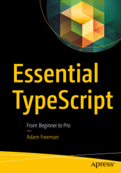

<h1 align="center">Essential TypeScript</h1>

  
   
  <i>This repository accompanies <a href="https://www.apress.com/9781484249789">Essential TypeScript</a>
   by Adam Freeman (Apress, 2019).</i>
   

  <a href="https://www.apress.com"><strong>www.apress.com</strong></a>
   

  <a href="CONTRIBUTING.md">Contributing Guidelines</a>
  ·
  <a href="https://github.com/Apress/essential-typescript/issues">Submit an Issue</a>
  ·
  <a href="https://www.apress.com/gp/blog">Blog</a>
   
   

  &nbsp;
  &nbsp;

## [Changelog](docs/CHANGELOG.md)
Release v1.0 corresponds to the code in the published book, without corrections or updates.

## [Code][essential-typescript-git]
Download the files as a [zip][essential-typescript-zip] using the green button, or clone the repository to your machine using Git.

## [Contributing](docs/CONTRIBUTING.md)
See the file [contributing](docs/CONTRIBUTING.md) for more information on how you can contribute to this repository.

[essential-typescript-git]: https://github.com/apress/essential-typescript
[essential-typescript-zip]: https://github.com/apress/essential-typescript/archive/refs/heads/master.zip
